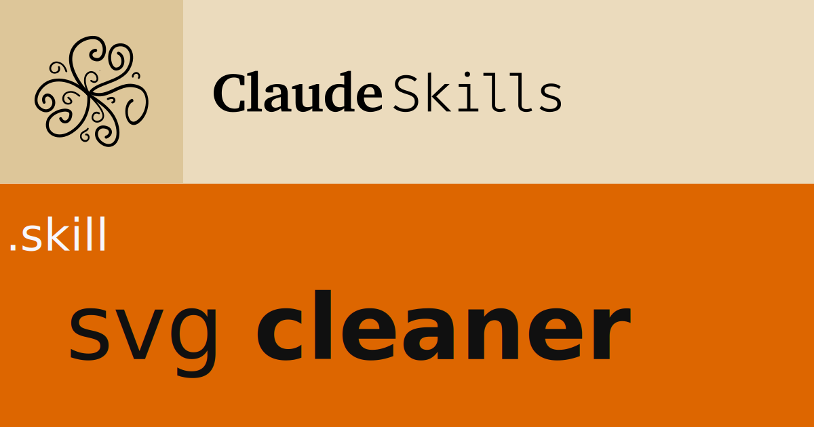

# SVG Cleaner Skill

A Claude skill for cleaning, optimizing, and batch-processing SVG files with support for sprite generation.

## Features

- 🧹 **Clean SVG files**: Merge paths, remove backgrounds, convert to currentColor
- ⚡ **Optimize**: SVGO integration with fallback for manual optimization
- 📦 **Batch processing**: Process entire folders of SVGs at once
- 🎨 **Sprite generation**: Automatically create SVG sprites from folders
- 🎯 **Element extraction**: Extract specific portions (e.g., single letters from logos)

## What It Does

### Single File Processing
- Merges multiple paths into one
- Removes backgrounds and clipPaths
- Applies `currentColor` for flexible theming
- Optimizes with SVGO (25-35% size reduction)

### Batch Folder Processing
- Finds all `.svg` files in a folder
- Cleans each SVG individually
- Saves as `filename-cc.svg`
- Creates combined sprite as `foldername-sprite-cc.svg`

## Installation

**A. Claude AI** (Claude in the cloud )

1. Download `svg-cleaner.skill`
2. Open Claude.ai
3. Go to Settings → Skills
4. Upload the `.skill` file

**B. Claude Code or CLI (local installation)**

1. Download `image-to-webp.skill`
2. Change the file extension to zip `svg-cleaner.skill`  → `svg-cleaner.zip` 
3. De compress the .zip in the ` .claude/sillks/` folder
4. remove the zip file

## Usage Examples

**Clean a single SVG:**
```
Clean this logo SVG and apply currentColor
```

**Process a folder:**
```
Clean all SVGs in /path/to/icons/ and create a sprite
```

**Extract specific element:**
```
Extract just the "g" letter from this logo
```

## Output Files

**Single file mode:**
- `filename-clean.svg` - Merged paths, no background
- `filename-currentcolor.svg` - With currentColor applied
- `filename-optimized.svg` - SVGO processed

**Batch folder mode:**
- `filename-cc.svg` - Each cleaned SVG
- `foldername-sprite-cc.svg` - Combined sprite with all icons

## Sprite Usage

Use the generated sprites in HTML:

```html
<svg>
  <use href="icons-sprite-cc.svg#logo"/>
</svg>
```

## Requirements

- Claude Desktop or Claude.ai with Skills enabled
- Optional: Node.js (for SVGO optimization)

## License

MIT License - See LICENSE file for details

## Contributing

Issues and pull requests welcome!

## Author

Created by Daniel Serrano for Claude Skills
